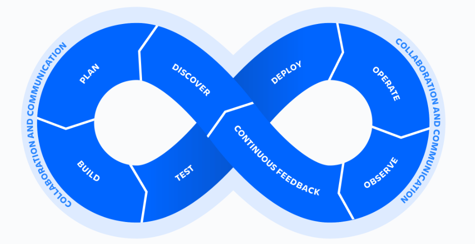

### Abstract

The purpose of this document is to try answering few fundamentals questions around DevOps. These answers are intentionally breif, and it's suggested to explore more around the questions of interest.

### What is DevOps?
DevOps is a software development methodology that emphasizes collaboration between teams, automation and continious improvement to deliver software faster and in a more reliabile manner.

### Why do need DevOps?
The DevOps movement started back in 2007, when software (code) was written by the development team and was supported and managed by IT teams. This often led to challenges in faster releases, software reliability etc. The term DevOps is a conjunction of two words "development" and "operations", signifying a single process of integrating these disciplines into one continious process.

### What are the DevOps principles?
DevOps principles includes continious improvemnet, collaboration, automation, monitoring and observability.

### What is the DevOps lifecylce?
DevOps lifecycle consits of 8 steps that go hand-in-hand together to improve the overall software delivery process. These 8 steps are often represented using a continious loops or an infinity symbol, highlighting the iterative nature of these different steps.

### What are some of the DevOps practices?

DevOps consists set of practices that helps improve the overall software delivery process. Few key DevOps practices are mentioned below

- Version Control
- Continious Integration
- Continious Deployment
- Automation
- Monitoring and Observability

### Benefits of using DevOps?
Here are few benefits of using DevOps

- Faster delivery speed
- Improved collaboration
- Rapid development
- Increased quality and reliability
- Better security

### What are some of the challenges?
In order for DevOps to be effective, it requires teams to have a certain mindset which often requires some sort of cultural transformation.